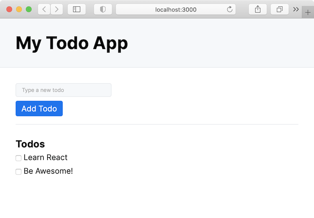

# Day 1: Getting Started with React

## Today's Learning Objectives

Today's goal is to set up the structure of our application and end up with a basic, static page.

## Your Mission

### Step 1. Installation

Create a folder for this project (I suggest you call it `intro-react`). Inside this folder, type the following command:

```sh
npm create vite@latest intro-react -- --template react
# Vite requires Node.js version 18+. 20+
```

NB: we use the tool [Vite](https://vitejs.dev/guide/) because it is faster and more modern (NB: and it works also for Vue.js, Svelte, etc. !).

> but if you want to use [create-react-app](https://create-react-app.dev/), you can use the following command:
`npx create-react-app .`

The installation may take a moment. At the end you will see a recap in your terminal with a few commands you now have available. The most important ones are:

1. `npm run dev` (or `yarn dev` if you prefer **yarn** to **npm**, and there's also pnpm if you want) is the command you will use every time you work on the application locally - it will start a local server, do a bunch of magics, and provide the application at an address like `http://localhost:3000`
2. `npm run build` (or `yarn build`..) will create the production-ready application files inside a folder called `build` (this is the folder that you can drop in Heroku or Netlify when you will deploy your code).

Launch your app and make sure it works ! 🚀

### Step 2. Git

I shouldn't be saying it but... `git init`, commit, push etc.!

And check if you have a `.gitignore` file with node_modules and others files you don't need to push ! Let's forget these beginners mistakes from now on! 😎

### Step 3. Start! And code...

Try to change something in the file `App.js`. For example, change the default text to:

`Learn React @ BeCode`

and save. The browser will immediately reload with the new version. Isn't that cool?

### Step 4. Time to do some real work

Up until now, you have been served everything. It's time to code.

Your goal for today is to create the components that form the app. You are creating a static skeleton with a fixed list of todos. Tomorrow we will see how to make it interactive. Here is what it should look like, structure-wise:



Note: it doesn't have to look _identical_ but it does have to have the following features:

- an input field to type new todos
- a submit button
- a list of todos (just add 2-3 todos)
- each todo has a checkbox next to it

Make sure that you:

- create different React components for the various parts (the list above is a BIG help in how to structure your components \*wink wink\*)
- place every component in a different file (the convention is that the filename is equal to the component name), and use the `import`/`export` of ES6 syntax to import them into the `App.js` file

### Step 5.

Done?

If you think you are done, push your changes to GitHub and ping your coach on Discord so that he/she can check the code you wrote.

Bonus: 
- try to style your app a bit. You can use CSS, or you can use a library like [TailwindCSS](https://tailwindcss.com/).
- build and deploy the app on Heroku/Netlify, and share the link with your coach.

## Good Luck!

<div style="width:480px"><iframe allow="fullscreen" frameBorder="0" height="270" src="https://giphy.com/embed/9Tnzp6mvFMibjyYA1v/video" width="300"></iframe></div>